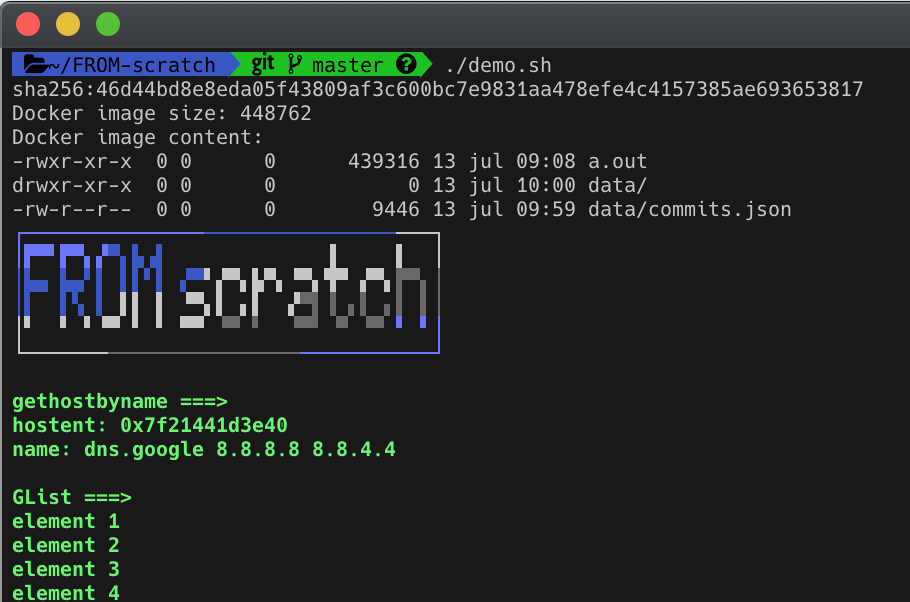

# FROM scratch

Demonstration of creating a base image that contains a statically-linked program.

## The background

In classic Linux distro, some libraries are available only for dynamic linking (ex: GLib). Even the [glibc](https://www.gnu.org/software/libc/) requires a dynamically loaded library for some functions ([see here](https://stackoverflow.com/questions/2725255/create-statically-linked-binary-that-uses-getaddrinfo)).

In order to create an [empty Docker image](https://docs.docker.com/develop/develop-images/baseimages/), you will need statically linked program that will not require or load any dynamic libraries.

The best choice is to use [musl-libc](https://www.musl-libc.org) and [Alpine Linux](https://alpinelinux.org), where all the hard work has already be done.

## Building the image

The Docker image uses a [multi-stage build](https://docs.docker.com/develop/develop-images/multistage-build/).

- the first stage prepares the build environment (compiler and libraries)
- the second one creates a bare image with only the program and its data

## Running the demo

The [demo.sh](demo.sh) script builds and inspects the image ([jq](https://stedolan.github.io/jq/) is required to filter the [inspect](https://docs.docker.com/engine/reference/commandline/inspect/) output, or comment line 8).

Then, it runs the unique executable (`a.out`) in the container.

